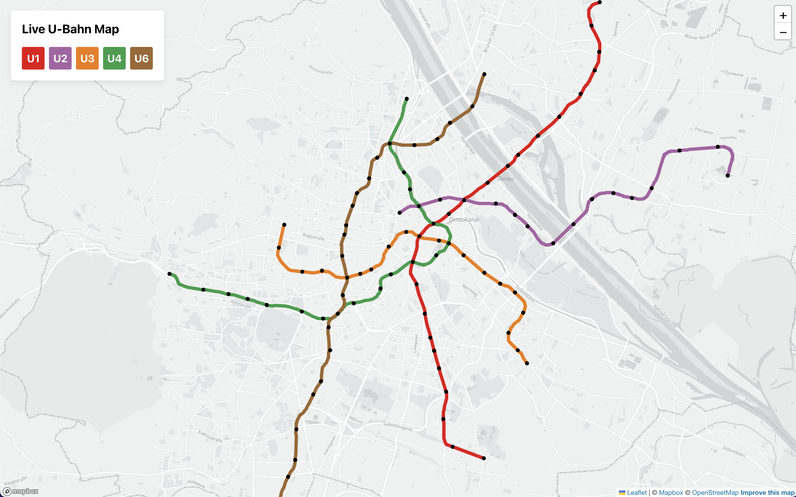
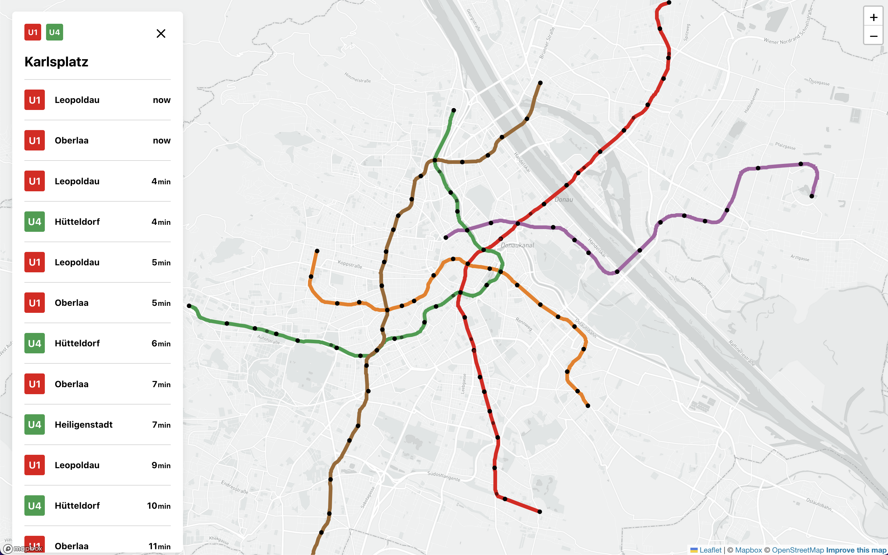

# Information Visualization Project – Wiener Linien U-Bahn Map

## Instructions

This app has been tested with Node.js version 16.

To start the local dev server, clone the repository (either by running `git clone https://github.com/msonnberger/info-vis.git`
or by downloading the project as a `.zip` file via GitHub) and run the following commands:

- `npm install`
- `npm run dev`

You can now view the app on `http://localhost:5173`.

## Aim

The aim of this project was to visualize the metro network of Vienna in an interactive way. Additionally, it was important
to me that the app has some kind of useful feature for the user instead of just looking cool.
Incorpating some kind of live, realtime data was also one of the goals.

## Description of dataset

The data used for this project consits of multiple CSV and JSON files which come from mainly two sources:

- [Wiener Linien GTFS Timetable data](https://www.data.gv.at/katalog/dataset/ab4a73b6-1c2d-42e1-b4d9-049e04889cf0)
- [Wiener Linien Realtime API](https://www.data.gv.at/katalog/dataset/wiener-linien-echtzeitdaten-via-datendrehscheibe-wien)

After downloading the files, I filtered the raw data and converted it to the best format for my application.
You can find the scripts I used for that in `data/filter-scripts/` and the resulting files in `data/`.
Some of the files were only used for intermediary steps to further filter the data.
The final files that are used directly in the application are the following:

- `lines.json`: contains manually gathered metadata for all five metro lines (name of both directions, color and darker accent color).
- `linesGeo.json`: in GeoJSON format, contains the `LinePath` elements for all metro lines.
- `stops.csv`: contains the coordinates and other data about each stop in the network (station name, id)

## Results

The resulting app fulfils all of the goals mentioned above. It provides a useful, interactive experience by visualizing
Vienna's metro network. By default, it shows all five metro lines in its respective color as well as a clickable dot
for each station. When a user selects a station, the sidebar changes to display the station name, the lines that stop
at that station and the countdown and destination of the next trains departing at that station. Additionally, for each
arriving train, one dot gets added to the line which shows the estimated live location of that train on the map. This
dot moves along the path of its line until it reaches the selected station.

The are two main use cases for this project: First, exploring the metro network and seeing where each line and station
is located on a real map, instead of a severly morphed plan. Second, looking up realtime departure data while commuting
in order to decide whether one has to hurry or if there is enough time to get a coffee.

### Findings

One thing that I found surprising is how much time went into filtering and converting the data into a form in which
it can be used directly. When dealing with such huge amounts of data (one raw file contained around 500MB!), one
cannot just edit some data manually but has to write a script which applies the transformation on all rows.
With many million rows, I even had to use read and write streams instead of loading the whole file in memory in
order to keep performance at an acceptable level.

d3.js is a very low-level, imperative library, which makes it both very powerful but also quite difficult to learn
and understand. It has some very convenient features built in, especially when looking at its mapping and projection
features (in my case). Unfortunately, d3's documentation is lacking and finding examples is difficult because
most question on the internet are from many years ago and thus do not apply (fully) to the newest version of d3.

## Code

The entry point for the application is in `main.js`, which imports all other necessary scripts from the `scripts/` directory.
In this directory the following files can be found:

- `map.js`: to draw the map of Vienna I used [Leaflet](https://leafletjs.com/), an open-source JavaScript library used
  for displaying and manipulating maps. As I wanted to use a [tiled](https://en.wikipedia.org/wiki/Tiled_web_map) map
  with interaction capabilities such as zooming and dragging as well as custom tiles from
  [Mapbox](https://www.mapbox.com/mapbox-studio/), I chose Leaflet as it's considerably faster than d3.js for this use case
  (which is better suited for [vectorized](https://en.wikipedia.org/wiki/Vector_tiles) maps). Leaflet provides an "overlay pane"
  which is an `svg` element that can be used by d3.js to add custom visualizations.
- `shapes.js`: in this file, the GeoJSON data for the lines as well as the stops data is loaded and added to the map.
  It creates a custom projection to transform longitude and latitude into SVG coordinates. See comments for further explanation.
- `legend.js`: Legend refers to the sidebar on the left side of the map which displays further information about the currently selected
  station and its departures. It fetches the realtime departure data from the API proxy (further explanation below) and updates the displayed values.
- `helpers.js`: in here, the current positions of trains approaching a selected station is calculated (based on the countdown to departure and
  the average speed of metro trains). The calculated positions are used in `shapes.js` to add dots to the lines, each
  of which represents a train on its way to the station.

### API Proxy

As the Wiener Linien realtime API does not support CORS headers (which results in CORS errors when used in the browser),
I had to implement a simple API which proxies (and filters) the response from the Wiener Linien API.
It uses [Cloudflare Workers](https://workers.cloudflare.com/) in order to provide fast response times.
The corresponding code for the API endpoint is located in `api/src/index.js`.

## Screenshots

